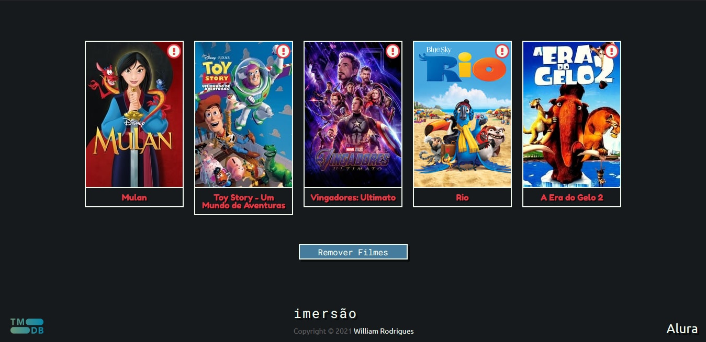

# AluraFlix

*[AluraFlix](https://willy-r.github.io/aluraflix/)* é um site para adicionar e visualizar as informações dos seus filmes favoritos.

  
  
   
  <small>
    Prints tirados do navegador <strong>Firefox Developer Edition v88.0b9</strong>
  </small>

## Sobre

Repositório para o desafio da quinta aula da #ImersaoDev da [Alura](https://www.alura.com.br/), onde eu decidi colocar aqui no GitHub. Esse foi o primeiro projeto "grande" usando HTML, CSS e JS (depois de 2 semanas estudando sobre) que eu fiz, deu um trabalho mas com muitas pesquisas no Google eu consegui finalizá-lo.

> Ele não tá nada responsivo pra mobile, mas é algo que eu pretendo fazer futuramente e se você quiser me ajudar a deixar ele responsivo ou melhorar alguma coisa no código, sinta-se à vontade para abrir um PR.
